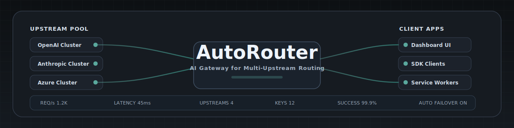
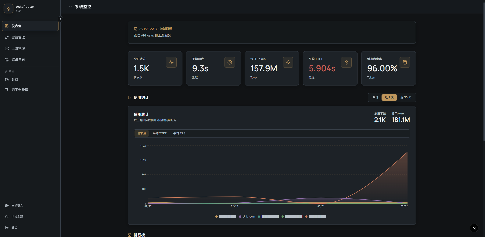
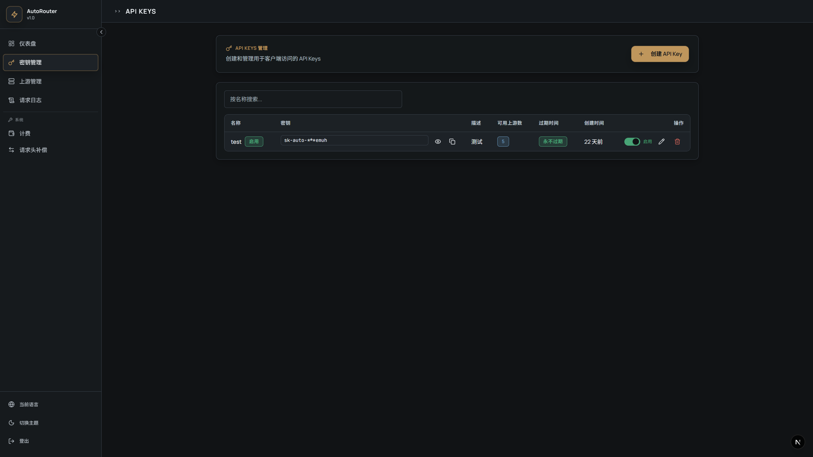

<div align="center">

<!-- Hero Banner -->


<h3>AI API Gateway</h3>
<p>一个极简的多上游 AI API 代理</p>

<!-- Badges: Status -->

[](https://github.com/g1331/AutoRouter/actions/workflows/lint.yml)
[](https://github.com/g1331/AutoRouter/actions/workflows/test.yml)
[](https://codecov.io/gh/g1331/AutoRouter)

<!-- Badges: Tech -->

[](https://nextjs.org/)
[](https://react.dev/)
[](https://www.typescriptlang.org/)
[](https://www.postgresql.org/)

<!-- Badges: Community -->

[](LICENSE)
[](https://github.com/g1331/AutoRouter/stargazers)
[](https://github.com/g1331/AutoRouter/issues)
[](https://github.com/g1331/AutoRouter/commits/master)

<br>

[English](./README_EN.md) · **简体中文**

</div>

---

## 目录

- [功能特性](#功能特性)
- [界面预览](#界面预览)
- [快速开始](#快速开始)
- [配置说明](#配置说明)
- [项目结构](#项目结构)
- [开发指南](#开发指南)
- [License](#license)

---

## 功能特性

<table>
<tr>
<td width="50%">

### 核心功能

- **API Key 管理** - 创建、分发和管理客户端密钥
- **权限控制** - 按 Key 设置模型访问权限和过期时间
- **多上游路由** - 支持 OpenAI、Anthropic、Azure 等
- **请求日志** - 完整的请求记录用于审计和调试

</td>
<td width="50%">

### 安全特性

- **密钥哈希** - API Keys 使用 bcrypt 单向哈希存储
- **加密存储** - 上游密钥使用 Fernet 对称加密
- **Token 认证** - 管理后台使用独立 Admin Token

</td>
</tr>
<tr>
<td width="50%">

### 用户体验

- **Cassette Futurism UI** - 复古未来主义设计风格
- **响应式布局** - 适配桌面和移动设备
- **主题切换** - 亮色 / 暗色 / 跟随系统

</td>
<td width="50%">

### 国际化

- **多语言支持** - 中文 / English
- **自动检测** - 根据浏览器语言自动切换
- **URL 路由** - `/zh` 和 `/en` 独立路由

</td>
</tr>
</table>

---

## 界面预览

<details open>
<summary><b>Dashboard - 系统监控</b></summary>
<br>

</details>

<details>
<summary><b>API Keys - 密钥管理</b></summary>
<br>

</details>

<details>
<summary><b>Upstreams - 上游配置</b></summary>
<br>

</details>

<details>
<summary><b>Login - 登录界面</b></summary>
<br>

</details>

---

## 快速开始

### 环境要求

| 依赖       | 版本 | 说明                                   |
| ---------- | ---- | -------------------------------------- |
| Node.js    | 22+  | 推荐使用 [pnpm](https://pnpm.io/) 管理 |
| PostgreSQL | 16+  | 生产环境必需                           |

### Docker 部署 (推荐)

```bash
# 1. 克隆项目
git clone https://github.com/g1331/AutoRouter.git
cd AutoRouter

# 2. 配置环境变量
cp .env.example .env
# 编辑 .env 文件，设置 ADMIN_TOKEN 和 ENCRYPTION_KEY

# 3. 启动服务
docker compose up -d

# 4. 访问 http://localhost:3000
```

### 本地开发

```bash
# 1. 克隆项目
git clone https://github.com/g1331/AutoRouter.git
cd AutoRouter

# 2. 复制环境变量
cp .env.example .env.local

# 3. 生成加密密钥 (填入 .env.local)
node -e "console.log(require('crypto').randomBytes(32).toString('base64'))"

# 4. 安装依赖
pnpm install

# 5. 数据库迁移
pnpm db:push

# 6. 启动开发服务器
pnpm dev
```

启动后访问 http://localhost:3000，使用 `ADMIN_TOKEN` 登录。

---

## 配置说明

### 环境变量 (`.env` 或 `.env.local`)

| 变量                 | 必填 | 说明                                  |
| -------------------- | :--: | ------------------------------------- |
| `DATABASE_URL`       |  ✓   | PostgreSQL 连接串                     |
| `ENCRYPTION_KEY`     |  ✓   | Fernet 加密密钥，用于加密上游 API Key |
| `ADMIN_TOKEN`        |  ✓   | 管理后台登录令牌                      |
| `LOG_RETENTION_DAYS` |      | 日志保留天数，默认 90 天              |

---

## 项目结构

```
AutoRouter/
├── src/
│   ├── app/                 # Next.js App Router
│   │   ├── [locale]/        # 国际化页面路由
│   │   └── api/             # API Routes
│   │       ├── admin/       # 管理 API
│   │       ├── proxy/       # 代理 API
│   │       └── health/      # 健康检查
│   ├── components/          # React 组件
│   ├── hooks/               # 自定义 Hooks
│   ├── lib/
│   │   ├── db/              # Drizzle ORM 配置
│   │   ├── services/        # 业务逻辑服务
│   │   └── utils/           # 工具函数
│   ├── messages/            # 翻译文件
│   └── i18n/                # 国际化配置
├── tests/                   # 测试用例
├── drizzle/                 # 数据库迁移
├── docs/                    # 文档资源
└── openspec/                # 设计规范
```

---

## 开发指南

<details>
<summary><b>代码检查</b></summary>

```bash
pnpm lint                  # ESLint
pnpm format                # Prettier
pnpm exec tsc --noEmit     # Type check
```

</details>

<details>
<summary><b>运行测试</b></summary>

```bash
pnpm test                  # Watch 模式
pnpm test:run              # 单次运行
pnpm test:run --coverage   # 覆盖率报告
```

</details>

<details>
<summary><b>数据库操作</b></summary>

```bash
pnpm db:generate           # 生成迁移文件
pnpm db:push               # 推送 Schema 到数据库
pnpm db:studio             # 打开 Drizzle Studio
```

</details>

---

## License

[AGPL-3.0](LICENSE) © 2025 AutoRouter Contributors

<div align="center">
<br>

如果这个项目对你有帮助，请考虑给一个 Star ⭐

<br>
</div>
