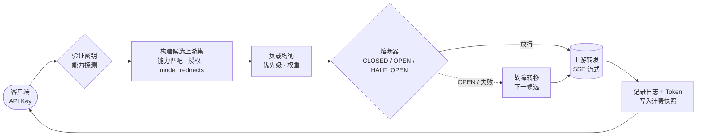
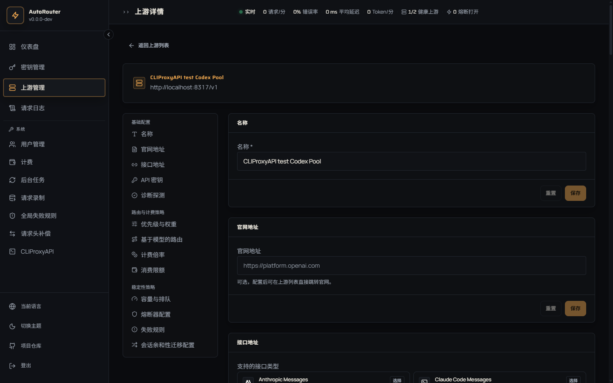
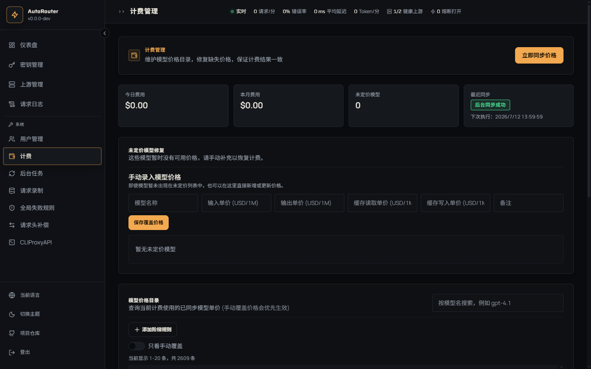

<div align="center">

<!-- Hero Banner -->


<br>
<br>

<b>面向多上游治理的 AI API Gateway</b>

<sub>OpenAI / Anthropic 兼容代理 · 能力路由 · 负载均衡 · 熔断故障转移 · 每请求计费 · 多租户管理台</sub>

<br>
<br>

<!-- Badges: Status -->

[](https://github.com/g1331/AutoRouter/actions/workflows/verify.yml)
[](https://github.com/g1331/AutoRouter/actions/workflows/release.yml)
[](https://codecov.io/gh/g1331/AutoRouter)
[](https://g1331.github.io/AutoRouter/)

<!-- Badges: Tech -->

[](https://nextjs.org/)
[](https://react.dev/)
[](https://www.typescriptlang.org/)
[](https://www.postgresql.org/)

<!-- Badges: Community -->

[](LICENSE)
[](https://github.com/g1331/AutoRouter/stargazers)
[](https://github.com/g1331/AutoRouter/issues)
[](https://github.com/g1331/AutoRouter/commits/master)

<br>

[English](./README_EN.md) · **简体中文** · [文档站](https://g1331.github.io/AutoRouter/)

</div>

---

## 这是什么

**AutoRouter** 是一个 Next.js 16（App Router）全栈应用：前端是一套国际化管理台，后端是一组 Next.js API Routes。它在 `/api/proxy/v1/*` 暴露一个 OpenAI / Anthropic 兼容的代理入口，把进入的流量按能力路由分发到多个上游，并在这条链路上叠加负载均衡、熔断、配额与并发控制、故障转移、会话亲和与逐请求计费。

一句话：**把散落的多家模型上游，收拢成一个可治理、可观测、可计费的统一网关。**

<div align="center">
<sub>客户端密钥　→　能力路由　→　负载均衡　→　熔断保护　→　上游转发　→　计费快照</sub>
</div>

---

## 功能特性

<table>
<tr>
<td width="50%" valign="top">

### 智能路由与代理

- **OpenAI / Anthropic 兼容代理** — 经 `/api/proxy/v1/*` 转发，支持普通响应与 SSE 流式
- **多上游能力路由** — 按请求路径能力与密钥授权构建候选集，叠加 `model_redirects`、优先级、权重择优
- **负载均衡与故障转移** — 权重分配 + 超时/5xx 自动切换到下一候选，逐次尝试均记录
- **准入与亲和** — 并发、配额、队列准入控制，会话亲和可把对话钉在既选上游

</td>
<td width="50%" valign="top">

### 计量与可观测

- **逐请求计费** — 价格同步、手工覆盖、阶梯规则、上游倍率合成成本，持久化为计费快照
- **可观测请求日志** — 记录候选集、路由决策、故障转移历史、会话亲和命中与 Token 用量
- **统计看板** — Overview / Timeseries / Leaderboard 三类视图，配实时日志 SSE
- **健康与熔断** — 后台健康检查 + 熔断状态查看与强制开关

</td>
</tr>
<tr>
<td width="50%" valign="top">

### 安全与多租户

- **双角色体系** — `admin` / `member`，管理台与自助门户按角色分流
- **分层鉴权** — `/api/admin/*` 用 `ADMIN_TOKEN` 或管理员 JWT；成员自助 `/api/user/*` 强制归属本人
- **密钥双层保护** — 客户端 API Key 以 bcrypt 哈希，上游密钥以 Fernet 加密存储
- **SSRF 防护** — 注册上游时阻断私网/回环/元数据地址并校验 DNS 解析

</td>
<td width="50%" valign="top">

### 运维与扩展

- **CLIProxyAPI 集成** — 管理 sidecar 实例，驱动 Codex / Claude / Gemini 的 OAuth 登录
- **后台定时同步** — 价格同步、上游模型目录同步、录制清理，支持手动触发
- **流量录制与回放** — 录制为 fixtures，非生产环境经 `/api/mock/*` 回放
- **双数据库方言 + 国际化** — PostgreSQL（生产）/ SQLite（本地）、中文 / English

</td>
</tr>
</table>

---

## 架构速览

一次代理请求在网关内的生命周期：


```mermaid
flowchart LR
    C([客户端<br/>API Key]) --> V{验证密钥<br/>能力探测}
    V --> R[构建候选上游集<br/>能力匹配 · 授权 · model_redirects]
    R --> LB[负载均衡<br/>优先级 · 权重]
    LB --> CB{熔断器<br/>CLOSED / OPEN / HALF_OPEN}
    CB -->|放行| U[(上游转发<br/>SSE 流式)]
    CB -.->|OPEN / 失败| FO[故障转移<br/>下一候选]
    FO --> U
    U --> B[记录日志 + Token<br/>写入计费快照]
    B --> C
```

- **能力路由**：从请求路径与模型名探测能力（chat / responses / messages 等），解析出对应 provider 与候选上游。
- **准入控制**：进入上游前完成并发、配额与队列准入；命中会话亲和时优先复用既选上游。
- **韧性**：超时或 5xx 触发故障转移并逐次记录；熔断器按上游维护 CLOSED / OPEN / HALF_OPEN 状态机。
- **计费闭环**：成功或失败都落请求日志，成功请求额外合成成本并持久化计费快照。

> 更完整的请求生命周期、上游模型与熔断细节见文档站 [架构介绍](https://g1331.github.io/AutoRouter/guide/architecture/overview)。

---

## 界面预览

> 管理台采用 Ops Console 视觉体系：深色主人格、amber 强调色、终端/运维美学、LED 状态灯与熔断芯片。

<details open>
<summary><b>Dashboard · 系统监控</b></summary>
<br>

</details>

<details open>
<summary><b>Logs · 请求日志</b></summary>
<br>

</details>

<details>
<summary><b>Upstreams · 上游配置</b></summary>
<br>

</details>

<details>
<summary><b>Upstream Detail · 上游详情</b></summary>
<br>

</details>

<details>
<summary><b>API Keys · 密钥管理</b></summary>
<br>

</details>

<details>
<summary><b>Billing · 计费总览</b></summary>
<br>

</details>

<details>
<summary><b>Login · 登录界面</b></summary>
<br>

</details>

### 移动端预览

|                                        仪表盘                                        |                                       上游管理                                       |
| :----------------------------------------------------------------------------------: | :----------------------------------------------------------------------------------: |
|  |  |
|                                     **请求日志**                                     |                                     **密钥管理**                                     |
|            |        |

---

## 快速开始

Docker Compose 是最省心的启动方式（自带 PostgreSQL 服务）：

```bash
git clone https://github.com/g1331/AutoRouter.git
cd AutoRouter
cp .env.example .env
# 编辑 .env：至少设置 ADMIN_TOKEN 与 ENCRYPTION_KEY
docker compose up -d
# 默认访问 http://localhost:3331
```

> 生成 `ENCRYPTION_KEY`（44 位 base64）：
>
> ```bash
> node -e "console.log(require('crypto').randomBytes(32).toString('base64'))"
> ```

**运行要求**：Node.js 22+（源码构建场景）、PostgreSQL 16（默认，生产推荐）；本地开发可切换 SQLite 沙箱。宿主端口默认 **3331** 映射到容器内 **3000**。

更完整的部署形态、版本发布、个人部署 secrets、源码本地开发与 SQLite 切换流程，见文档站 [部署指南](https://g1331.github.io/AutoRouter/guide/deployment/overview)。

---

## 配置要点

环境变量经 `src/lib/utils/config.ts` 的 Zod schema 校验。最小可用集：

| 变量               | 必需 | 说明                                                                 |
| ------------------ | :--: | -------------------------------------------------------------------- |
| `DATABASE_URL`     |  ▲   | PostgreSQL 连接串（使用 PG 时必需；未设置则按 SQLite 自动探测）      |
| `ENCRYPTION_KEY`   |  ●   | 上游密钥 Fernet 加密根（44 位 base64，32 字节）                      |
| `ADMIN_TOKEN`      |  ●   | 管理面 API 鉴权令牌                                                  |
| `DB_TYPE`          |      | `postgres` \| `sqlite`，未设置时从 `DATABASE_URL` 自动推断           |
| `JWT_SECRET`       |      | 用户登录 JWT 的 HS256 密钥；未设置则从 `ENCRYPTION_KEY` 经 HKDF 派生 |
| `ALLOW_KEY_REVEAL` |      | 是否允许经 Admin API 明文回显密钥，默认 `false`                      |
| `RECORDER_ENABLED` |      | 是否开启流量录制，默认关闭（compose/部署可开启）                     |

完整清单见 [`.env.example`](.env.example) 与文档站 [环境变量参考](https://g1331.github.io/AutoRouter/guide/deployment/env-reference)。

---

## 文档与延伸阅读

| 主题                   | 链接                                                                                                                                                                                 |
| ---------------------- | ------------------------------------------------------------------------------------------------------------------------------------------------------------------------------------ |
| 部署形态与快速开始     | [`guide/deployment`](https://g1331.github.io/AutoRouter/guide/deployment/overview)                                                                                                   |
| 环境变量参考           | [`guide/deployment/env-reference`](https://g1331.github.io/AutoRouter/guide/deployment/env-reference)                                                                                |
| GitHub Actions 部署    | [`guide/deployment/github-actions`](https://g1331.github.io/AutoRouter/guide/deployment/github-actions)                                                                              |
| 管理后台使用指南       | [`guide/usage`](https://g1331.github.io/AutoRouter/guide/usage/admin-overview)                                                                                                       |
| 整体架构与请求生命周期 | [`guide/architecture`](https://g1331.github.io/AutoRouter/guide/architecture/overview)                                                                                               |
| 测试策略与贡献规范     | [`guide/architecture/testing`](https://g1331.github.io/AutoRouter/guide/architecture/testing) · [`contributing`](https://g1331.github.io/AutoRouter/guide/architecture/contributing) |

面向贡献者的开发命令、目录结构与协作约定见仓库根目录的 [`AGENTS.md`](AGENTS.md)。

---

## License

[AGPL-3.0](LICENSE) © 2025 AutoRouter Contributors

<div align="center">
<br>

如果这个项目对你有帮助，欢迎点一个 Star ⭐

<br>
</div>
