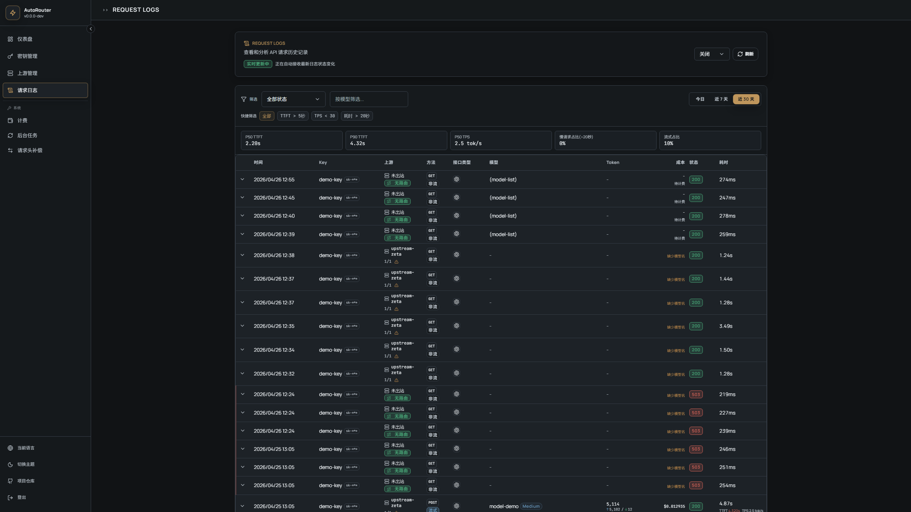

<div align="center">

<!-- Hero Banner -->


<h3>AI API Gateway</h3>
<p>A minimalist multi-upstream AI API proxy</p>

<!-- Badges: Status -->

[](https://github.com/g1331/AutoRouter/actions/workflows/lint.yml)
[](https://github.com/g1331/AutoRouter/actions/workflows/test.yml)
[](https://codecov.io/gh/g1331/AutoRouter)

<!-- Badges: Tech -->

[](https://nextjs.org/)
[](https://react.dev/)
[](https://www.typescriptlang.org/)
[](https://www.postgresql.org/)

<!-- Badges: Community -->

[](LICENSE)
[](https://github.com/g1331/AutoRouter/stargazers)
[](https://github.com/g1331/AutoRouter/issues)
[](https://github.com/g1331/AutoRouter/commits/master)

<br>

**English** · [简体中文](./README.md)

</div>

---

## Table of Contents

- [Features](#features)
- [Screenshots](#screenshots)
- [Quick Start](#quick-start)
- [Configuration](#configuration)
- [Project Structure](#project-structure)
- [Development Guide](#development-guide)
- [License](#license)

---

## Features

<table>
<tr>
<td width="50%">

### Core Features

- **OpenAI-Compatible Proxy** - Forward requests via `/api/proxy/v1/*` with regular responses and SSE streaming
- **API Key Lifecycle Management** - Create, update, disable and revoke keys with upstream bindings and expiration control
- **Intelligent Multi-Upstream Routing** - Route by model prefix with `allowed_models`, `model_redirects`, weight, and priority
- **Observable Request Logs** - Persist routing decisions, failover history, session-affinity hit status, and token metrics

</td>
<td width="50%">

### Security Features

- **Dual-Layer Secret Protection** - API keys are bcrypt-hashed, upstream secrets are Fernet-encrypted at rest
- **Isolated Admin Authentication** - `/api/admin/*` is protected by dedicated `ADMIN_TOKEN`
- **SSRF Protection** - Upstream URL validation blocks private/loopback/metadata targets and validates DNS resolution
- **Sensitive Operation Guardrail** - `ALLOW_KEY_REVEAL` is off by default to prevent accidental secret exposure

</td>
</tr>
<tr>
<td width="50%">

### User Experience

- **Rebuilt Admin Visual System** - Unified light/dark semantics with stronger information hierarchy and readability
- **Responsive Navigation** - Desktop sidebar plus mobile bottom navigation
- **Statistics Workspace** - Overview / Timeseries / Leaderboard dashboards
- **Health and Circuit Controls** - Upstream health visibility with circuit-breaker state and force-open/close operations

</td>
<td width="50%">

### Internationalization

- **Multi-language Support** - Chinese / English
- **Language Switcher** - Switch language directly from sidebar and settings
- **URL Routing** - Independent `/zh-CN` and `/en` routes

</td>
</tr>
</table>

---

## Screenshots

<details open>
<summary><b>Login - Authentication</b></summary>
<br>

</details>

<details open>
<summary><b>Dashboard - System Monitoring</b></summary>
<br>

</details>

<details open>
<summary><b>Logs - Request Observability</b></summary>
<br>

</details>

<details>
<summary><b>API Keys - Key Management</b></summary>
<br>

</details>

<details>
<summary><b>Upstreams - Upstream Configuration</b></summary>
<br>

</details>

---

## Quick Start

### Requirements

| Dependency | Version | Notes                                               |
| ---------- | ------- | --------------------------------------------------- |
| Node.js    | 22+     | Recommend using [pnpm](https://pnpm.io/)            |
| PostgreSQL | 16+     | Recommended for production (default)                |
| SQLite     | Latest  | Optional for local development via `DB_TYPE=sqlite` |

### Docker Deployment (Recommended)

```bash
# 1. Clone the repository
git clone https://github.com/g1331/AutoRouter.git
cd AutoRouter

# 2. Configure environment variables
cp .env.example .env
# Edit .env file, set ADMIN_TOKEN and ENCRYPTION_KEY

# 3. Start services
docker compose up -d

# 4. Visit http://localhost:${PORT:-3000}
```

### Local Development

```bash
# 1. Clone the repository
git clone https://github.com/g1331/AutoRouter.git
cd AutoRouter

# 2. Copy environment variables
cp .env.example .env.local

# 3. Generate encryption key (add to .env.local)
node -e "console.log(require('crypto').randomBytes(32).toString('base64'))"

# 4. Install dependencies
pnpm install

# 5. Database migration
pnpm db:push

# 6. Start development server
pnpm dev
```

After starting, visit http://localhost:3000 and login with `ADMIN_TOKEN`.

---

## Configuration

### Environment Variables (`.env` or `.env.local`)

| Variable                    | Required | Description                                                 |
| --------------------------- | :------: | ----------------------------------------------------------- |
| `DATABASE_URL`              |   Yes    | PostgreSQL URL (used when `DB_TYPE=postgres`)               |
| `DB_TYPE`                   |          | Database backend: `postgres` (default) or `sqlite`          |
| `SQLITE_DB_PATH`            |          | SQLite file path (used when `DB_TYPE=sqlite`)               |
| `ENCRYPTION_KEY`            |  Yes\*   | Fernet key (either this or `ENCRYPTION_KEY_FILE`)           |
| `ENCRYPTION_KEY_FILE`       |  Yes\*   | Load Fernet key from file (either this or `ENCRYPTION_KEY`) |
| `ADMIN_TOKEN`               |   Yes    | Admin console login token                                   |
| `ALLOW_KEY_REVEAL`          |          | Allow revealing full API keys, default `false`              |
| `LOG_RETENTION_DAYS`        |          | Request log retention days, default `90`                    |
| `LOG_LEVEL`                 |          | Log level: `fatal`/`error`/`warn`/`info`/`debug`/`trace`    |
| `DEBUG_LOG_HEADERS`         |          | Debug header logging switch, default `false`                |
| `HEALTH_CHECK_INTERVAL`     |          | Upstream health check interval in seconds, default `30`     |
| `HEALTH_CHECK_TIMEOUT`      |          | Upstream health check timeout in seconds, default `10`      |
| `CORS_ORIGINS`              |          | CORS allowlist, comma-separated                             |
| `PORT`                      |          | Service port, default `3000`                                |
| `RECORDER_ENABLED`          |          | Enable traffic recorder (recommended only in development)   |
| `RECORDER_MODE`             |          | Recorder mode: `all` / `success` / `failure`                |
| `RECORDER_FIXTURES_DIR`     |          | Fixture output directory, default `tests/fixtures`          |
| `RECORDER_REDACT_SENSITIVE` |          | Redact sensitive fields in fixtures, default `true`         |

---

## Project Structure

```
AutoRouter/
├── src/
│   ├── app/                 # Next.js App Router
│   │   ├── [locale]/        # Internationalized page routes
│   │   └── api/             # API Routes
│   │       ├── admin/       # Admin API
│   │       ├── mock/        # Fixture replay mock API (development)
│   │       ├── proxy/       # Proxy API
│   │       └── health/      # Health check
│   ├── components/          # React components
│   ├── hooks/               # Custom Hooks
│   ├── lib/
│   │   ├── db/              # Drizzle ORM config
│   │   ├── services/        # Business logic services
│   │   └── utils/           # Utility functions
│   ├── messages/            # Translation files
│   └── i18n/                # i18n configuration
├── tests/                   # Test cases
├── drizzle/                 # Database migrations
├── docs/                    # Documentation
└── openspec/                # Design specifications
```

---

## Development Guide

<details>
<summary><b>Code Checking</b></summary>

```bash
pnpm lint                  # ESLint
pnpm format                # Prettier
pnpm exec tsc --noEmit     # Type check
```

</details>

<details>
<summary><b>Running Tests</b></summary>

```bash
pnpm test                  # Watch mode
pnpm test:run              # Single run
pnpm test:run --coverage   # Coverage report
pnpm e2e                   # Playwright E2E
pnpm e2e:headed            # Run E2E with visible browser
```

</details>

<details>
<summary><b>Database Operations</b></summary>

```bash
pnpm db:generate           # Generate migration files
pnpm db:migrate            # Apply migrations
pnpm db:push               # Push schema to database
pnpm db:seed               # Seed lightweight sample data
pnpm db:studio             # Open Drizzle Studio
```

</details>

---

## License

[AGPL-3.0](LICENSE) © 2025 AutoRouter Contributors

<div align="center">
<br>

If this project helps you, please consider giving it a Star

<br>
</div>
