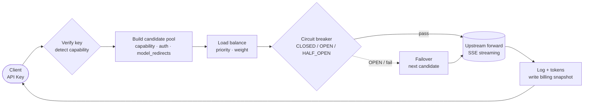

<div align="center">

<!-- Hero Banner -->


<br>
<br>

<b>An AI API Gateway for multi-upstream routing and operations</b>

<sub>OpenAI / Anthropic-compatible proxy · capability routing · load balancing · circuit breaking & failover · per-request billing · multi-tenant console</sub>

<br>
<br>

<!-- Badges: Status -->

[](https://github.com/g1331/AutoRouter/actions/workflows/verify.yml)
[](https://github.com/g1331/AutoRouter/actions/workflows/release.yml)
[](https://codecov.io/gh/g1331/AutoRouter)
[](https://g1331.github.io/AutoRouter/)

<!-- Badges: Tech -->

[](https://nextjs.org/)
[](https://react.dev/)
[](https://www.typescriptlang.org/)
[](https://www.postgresql.org/)

<!-- Badges: Community -->

[](LICENSE)
[](https://github.com/g1331/AutoRouter/stargazers)
[](https://github.com/g1331/AutoRouter/issues)
[](https://github.com/g1331/AutoRouter/commits/master)

<br>

**English** · [简体中文](./README.md) · [Docs](https://g1331.github.io/AutoRouter/)

</div>

> The full documentation site is maintained in Simplified Chinese. This English README covers the high-level overview, screenshots, and the minimal Docker quick start; for deployment, configuration, and architecture details follow the doc-site links below or use your browser's translation.

---

## What is it

**AutoRouter** is a Next.js 16 (App Router) fullstack application: the frontend is an internationalized admin console, the backend is a set of Next.js API Routes. It exposes an OpenAI / Anthropic-compatible proxy at `/api/proxy/v1/*` that fans incoming traffic out to multiple upstreams by capability-based routing, layering load balancing, circuit breaking, quota & concurrency control, failover, session affinity, and per-request billing onto that path.

In one line: **collapse scattered model upstreams into a single gateway that is governable, observable, and billable.**

<div align="center">
<sub>client key　→　capability routing　→　load balancing　→　circuit breaking　→　upstream forward　→　billing snapshot</sub>
</div>

---

## Features

<table>
<tr>
<td width="50%" valign="top">

### Routing & Proxy

- **OpenAI / Anthropic-compatible proxy** — forward via `/api/proxy/v1/*` with regular responses and SSE streaming
- **Multi-upstream capability routing** — build candidate pools from path capability and key authorization, then apply `model_redirects`, priority, and weight
- **Load balancing & failover** — weighted selection plus automatic switch to the next candidate on timeout / 5xx, with every attempt logged
- **Admission & affinity** — concurrency, quota, and queue admission control; session affinity pins a conversation to its chosen upstream

</td>
<td width="50%" valign="top">

### Metering & Observability

- **Per-request billing** — cost composed from synced prices, manual overrides, tier rules, and per-upstream multipliers, persisted as a billing snapshot
- **Observable request logs** — candidate pools, routing decisions, failover history, session-affinity hits, and token usage
- **Statistics workspace** — Overview / Timeseries / Leaderboard dashboards plus live-log SSE
- **Health & circuit controls** — background health checks with circuit-breaker state and force-open/close

</td>
</tr>
<tr>
<td width="50%" valign="top">

### Security & Multi-tenancy

- **Two-role model** — `admin` / `member`, with console and self-service portal split by role
- **Layered authentication** — `/api/admin/*` accepts `ADMIN_TOKEN` or an admin JWT; member `/api/user/*` is forced to the caller's own scope
- **Dual-layer secret protection** — client API keys are bcrypt-hashed, upstream secrets are Fernet-encrypted at rest
- **SSRF protection** — blocks private/loopback/metadata targets and validates DNS resolution when registering upstreams

</td>
<td width="50%" valign="top">

### Operations & Extensibility

- **CLIProxyAPI integration** — manage sidecar instances and drive OAuth login for Codex / Claude / Gemini
- **Scheduled background sync** — price sync, upstream model-catalog sync, and recording cleanup, all manually triggerable
- **Traffic recording & replay** — record as fixtures, replay via `/api/mock/*` in non-production
- **Dual-dialect DB + i18n** — PostgreSQL (production) / SQLite (local), Chinese / English

</td>
</tr>
</table>

---

## Architecture at a glance

The lifecycle of a single proxy request inside the gateway:


```mermaid
flowchart LR
    C([Client<br/>API Key]) --> V{Verify key<br/>detect capability}
    V --> R[Build candidate pool<br/>capability · auth · model_redirects]
    R --> LB[Load balance<br/>priority · weight]
    LB --> CB{Circuit breaker<br/>CLOSED / OPEN / HALF_OPEN}
    CB -->|pass| U[(Upstream forward<br/>SSE streaming)]
    CB -.->|OPEN / fail| FO[Failover<br/>next candidate]
    FO --> U
    U --> B[Log + tokens<br/>write billing snapshot]
    B --> C
```

- **Capability routing** — detect capability (chat / responses / messages, …) from path and model, resolve the provider and candidate upstreams.
- **Admission control** — concurrency, quota, and queue admission before forwarding; session affinity reuses the previously selected upstream when it hits.
- **Resilience** — timeouts or 5xx trigger failover with each attempt logged; the breaker maintains a CLOSED / OPEN / HALF_OPEN state machine per upstream.
- **Billing loop** — both success and failure are logged; successful requests additionally compose cost and persist a billing snapshot.

> For the full request lifecycle, upstream model, and circuit-breaker details, see the [Architecture guide](https://g1331.github.io/AutoRouter/guide/architecture/overview) on the docs site.

---

## Screenshots

> The console uses the Ops Console visual system: a dark-first persona, amber accent, terminal/operations aesthetics, LED status lights, and circuit-breaker chips.

<details open>
<summary><b>Dashboard · System Monitoring</b></summary>
<br>

</details>

<details open>
<summary><b>Logs · Request Observability</b></summary>
<br>

</details>

<details>
<summary><b>Upstreams · Upstream Configuration</b></summary>
<br>

</details>

<details>
<summary><b>Upstream Detail</b></summary>
<br>

</details>

<details>
<summary><b>API Keys · Key Management</b></summary>
<br>

</details>

<details>
<summary><b>Billing · Cost Overview</b></summary>
<br>

</details>

<details>
<summary><b>Login · Authentication</b></summary>
<br>

</details>

### Mobile Preview

|                                      Dashboard                                       |                                      Upstreams                                       |
| :----------------------------------------------------------------------------------: | :----------------------------------------------------------------------------------: |
|  |  |
|                                       **Logs**                                       |                                     **API Keys**                                     |
|            |        |

---

## Quick Start

Docker Compose is the easiest way to start (ships a PostgreSQL service):

```bash
git clone https://github.com/g1331/AutoRouter.git
cd AutoRouter
cp .env.example .env
# Edit .env: at minimum set ADMIN_TOKEN and ENCRYPTION_KEY
docker compose up -d
# Visit http://localhost:3331 by default
```

> Generate `ENCRYPTION_KEY` (44-char base64):
>
> ```bash
> node -e "console.log(require('crypto').randomBytes(32).toString('base64'))"
> ```

**Requirements**: Node.js 22+ (for source builds), PostgreSQL 16 (default, recommended for production); SQLite is available as a local dev sandbox. The host port **3331** maps to container port **3000** by default.

For deployment topologies, the release workflow, personal-deployment secrets, source-based local development, and SQLite switching, see the [Deployment Guide](https://g1331.github.io/AutoRouter/guide/deployment/overview) on the docs site (Simplified Chinese; browser translation works for the prose, code blocks stay in English).

---

## Configuration

Environment variables are validated by a Zod schema in `src/lib/utils/config.ts`. The minimal set:

| Variable           | Required | Description                                                                      |
| ------------------ | :------: | -------------------------------------------------------------------------------- |
| `DATABASE_URL`     |    ▲     | PostgreSQL connection string (required with PG; auto-detects SQLite if unset)    |
| `ENCRYPTION_KEY`   |    ●     | Fernet root for upstream secrets (44-char base64, 32 bytes)                      |
| `ADMIN_TOKEN`      |    ●     | Admin API authentication token                                                   |
| `DB_TYPE`          |          | `postgres` \| `sqlite`; inferred from `DATABASE_URL` when unset                  |
| `JWT_SECRET`       |          | HS256 key for user-login JWTs; derived from `ENCRYPTION_KEY` via HKDF when unset |
| `ALLOW_KEY_REVEAL` |          | Whether the Admin API may reveal plaintext keys; default `false`                 |
| `RECORDER_ENABLED` |          | Enable traffic recording; off by default (compose/deploy may enable it)          |

Full list in [`.env.example`](.env.example) and the [Environment variable reference](https://g1331.github.io/AutoRouter/guide/deployment/env-reference).

---

## Documentation

| Topic                              | Link                                                                                                                                                                                 |
| ---------------------------------- | ------------------------------------------------------------------------------------------------------------------------------------------------------------------------------------ |
| Deployment topologies & quickstart | [`guide/deployment`](https://g1331.github.io/AutoRouter/guide/deployment/overview)                                                                                                   |
| Environment variable reference     | [`guide/deployment/env-reference`](https://g1331.github.io/AutoRouter/guide/deployment/env-reference)                                                                                |
| GitHub Actions deployment          | [`guide/deployment/github-actions`](https://g1331.github.io/AutoRouter/guide/deployment/github-actions)                                                                              |
| Admin console usage                | [`guide/usage`](https://g1331.github.io/AutoRouter/guide/usage/admin-overview)                                                                                                       |
| Architecture & request lifecycle   | [`guide/architecture`](https://g1331.github.io/AutoRouter/guide/architecture/overview)                                                                                               |
| Testing strategy & contributing    | [`guide/architecture/testing`](https://g1331.github.io/AutoRouter/guide/architecture/testing) · [`contributing`](https://g1331.github.io/AutoRouter/guide/architecture/contributing) |

Contributor-facing development commands, project structure, and working conventions live in [`AGENTS.md`](AGENTS.md) at the repo root.

---

## License

[AGPL-3.0](LICENSE) © 2025 AutoRouter Contributors

<div align="center">
<br>

If this project helps you, please consider giving it a Star ⭐

<br>
</div>
